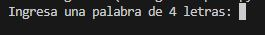
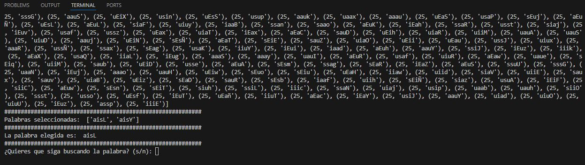
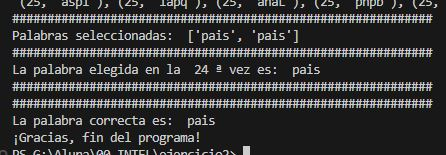

# Algoritmo Genetico

Ejercicio para encontrar una palabra en Python mediante algoritmo genetico,.

Este proyecto implementa un algoritmo genético simple en Python para aproximarse a una palabra de cuatro letras que el usuario ingresa. El proceso comienza con la generación de una población inicial de palabras aleatorias. Luego, se evalúan estas palabras en función de su similitud con la palabra ingresada por el usuario. A partir de esta evaluación, se seleccionan las dos mejores palabras para combinarse mediante un proceso de herencia, añadiendo mutaciones. Así, se generan nuevas poblaciones que evolucionan a lo largo de varias generaciones hasta encontrar la coincidencia más cercana a la palabra objetivo.

